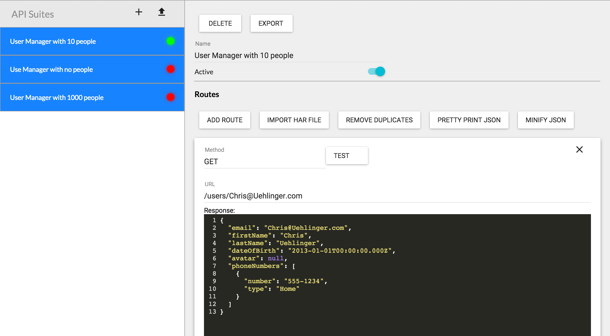

Flathead
========
Backend Mocking for people who dun care how the backend works.

The Problem we're solving
-------------------------

This one goes out to anyone who's had to build, style or test front-end stuff, but been held back by their API. Whether your API is unfinished, persnickity, or generally too polite for your taste, Flathead can help you see what would happen in any scenario, without having to create the data from scratch.

In essence, Flathead is a "static backend" that you can configure. The basic idea is "I hit this URL with this type of request... and I get that result". That's all there is. You want something more fancy? Go build an actual API. This is for the gunslingers who (for one reason or another) need to get by without one.

Install
-------

Flathead is available on npm:

  npm install -g flathead
  
Simply type `flathead` in your command line to spin it up. If you followed these instructions exactly, Google Chrome will open up a window with the URL `localhost:3192/admin`; this is where you will configure Flathead. Very good, leave this thing running forever. If for some reason you stop running it, start again soon (You can close/re-open the browser tab if you want to, that's not important).

If you want a port that isn't 3192, you can specify it:

  flathead --port 4000
  

Develop
-------

`git clone` the repository, go into the directory and type this magic incantation:

  npm install

To run Flathead in development mode, type this:

  gulp

Routes
------

In Flathead parlance, a route is a URL, a method (GET, POST, etc.) and a response. If Flathead receives a request with the correct method and URL, it will return the response that you've given it. It's that simple.

Suites
------

A Suite is a group of Routes. Generally you want these to be set up so that they will all correspond to a particular use case. Suites that are active are having their routes served by Flathead, Suites that are not active will not have their Routes served up.

### Creating a Suite by hand

If you press the "+" icon above the suite list, you'll create a new API suite. You can change it's name, whether or not it's active and also add/change/remove Routes. Make sure to Save changes to a Suite before trying to use any of its Routes.

### Creating Routes by hand

As you can see, you can add and remove Routes pretty easily. When you add a route, you can change the method, URL and response to suit whatever use you need.

As of v1.2.0, you can also create wildcard routes! Any route with a \* will treat that \* as a wildcard and match against any routes that satisfy the regex (Note: full regex functionality is not supported).

### Creating Routes from an existing API

If the API under test already exists, Hallelujah! Your job is easy!

Open the Chrome DevTools "Network" pane (you must do this first) and go to the page under test. Interact with the page until it performs the XHR requests you need. Right click on the list of requests and type "Save as HAR with Content". This will create an HTTP Archive (essentially a JSON file) with all the data/metadata from all the requests made since the pageload.

Back in Flathead, go to the Suite you're looking for and click "Import HAR". Select the .har file to import it. Flathead will remove all requests whose responses do not have a MIME type of `application/json` leaving only the XHR requests. It will automatically add those to the suite.

You can edit these Routes just like any other, allowing you to take an existing set of API responses and tweak it to your liking.

### Send these Suites to Someone Else!

Flathead suites can be imported/exported using a JSON file format (though heaven help you if you import some arbitrary JSON file). Once you've perfected a Suite, click the "Export" button to download it as a ".flathead.json" file. Send that file to anyone who wants to test the scenario you've created.

All they have to do is click the "Import Suite" icon located next to the "Add Suite" icon above the suite list, and they can choose to import the file you've sent them.